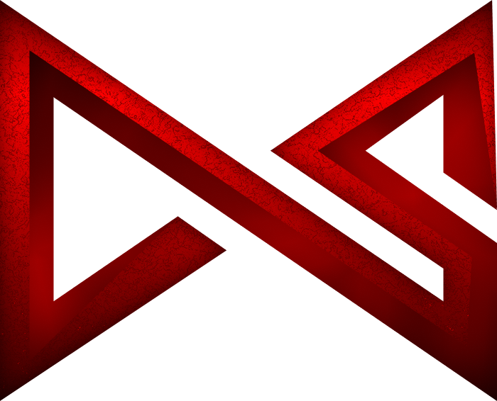

  

  
  

  <a href="https://cheaterstats.cc">
    
    <b>CheaterStats</b>
  </a>

  

<!-- <h1 align="center">Hey people</h1> -->

---

## 📄 My Profile

- 🇩🇪 tjayy, germany based Dev.
- 🏢 I work with CheaterStats and my very good friend 0jayy07.
- ⚡ I love to do discord application development.
- ⌨️ I do Fullstack development, but prefer backend stuff. 

## </> Tech Stack

- CheaterStats: Next.js, TypeScript & JavaScript
- Daily setup: VS Code, Git, Windows

  
  
  
  
  

## 💻 My Setup

- Windows Setup: AMD Ryzen 7 5800X, RTX 4080 and 32 GB RAM
